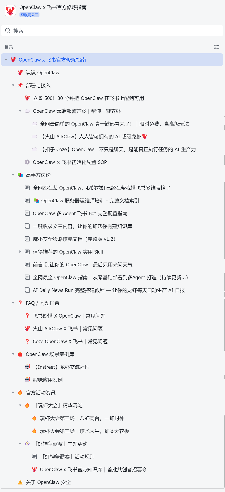
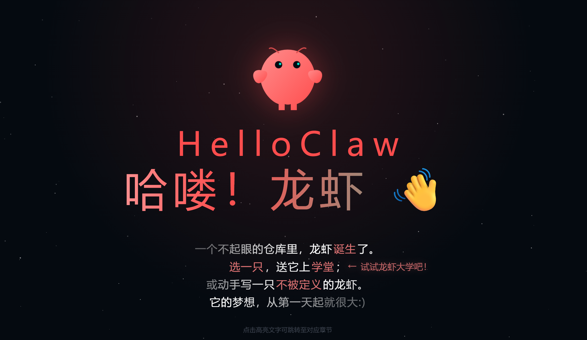

# 📖 精选教程汇总

这里人工筛选了 OpenClaw 最值得阅读的第三方教程，涵盖从零组装到进阶开发。让你不再需要花钱找人装虾。

>*点击链接即可跳转教程原网站*


# 🌟 入门首选！！！

> 这一部分推荐的教程适合刚开始接触OpenClaw的小白。

## 飞书官方教程
[OpenClaw x 飞书官方修炼指南](https://larkcommunity.feishu.cn/wiki/GGJPwJ2IfiTynVk2Vy4cZbRvn2f?from=from_copylink)



这一份飞书出品的教程最大的特点就是**看着不累**！文档除了推荐使用飞书自己的一键部署产品之外，也还是认真地介绍了本地部署的方式。大家可以根据自己的需求和系统，通过目录快速找到自己想读的内容。

> 一句话：推荐想要快速了解入门，侧重应用、产品端的朋友们。

## Datawhale团队出品教程
[Hello Claw - GitHub库](https://github.com/datawhalechina/hello-claw)
[Hello Claw - 教程网站](https://datawhalechina.github.io/hello-claw)

**十分、强烈、推荐！！！想要学习本地部署的同学赶紧来看！！！**



Datawhale 是一个专注于人工智能领域的非营利性开源学习社区 / 组织。该项目（hello-claw）是 Datawhale 推出的首个体系化 OpenClaw 中文开源教程，旨在帮助用户从零开始掌握这个*基于命令行（CLI）*的强大 AI 智能体（Agent）系统。

```js
🚀 hello-claw 项目核心特点

* **全栈式学习曲线**：内容设计涵盖了从“领养”（面向普通用户的一键部署、多端接入）到“进化”（面向开发者的架构解析、自定义插件开发）的完整路径。
* **多端生态集成**：突破了传统的 CLI 限制，重点指导用户如何将 AI Agent 接入 **飞书 (Lark)**、**Telegram** 等社交与办公平台，实现 24/7 在线的即时交互。
* **极简部署体验**：针对新手优化了安装流程，提供基于 Docker 和一键脚本的方案，显著降低了配置环境变量和运行环境的门槛。
* **工程化扩展能力**：强调插件化架构，支持用户通过编写简单的代码逻辑来扩展 AI 的功能，如自动化工作流、定时任务处理等。
* **社区驱动与本土化**：由 Datawhale 出品，文档语言通俗易懂，且针对国内常见的 API 模型、网络环境进行了深度适配与优化。
```

> 一句话：推荐想要从零开始掌握本地部署的同学来看。


*持续更新中…………*