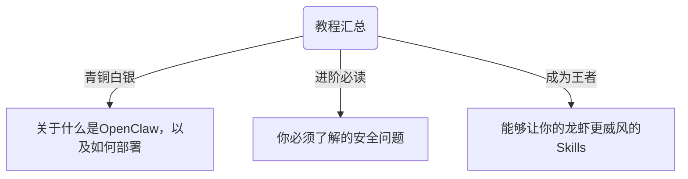
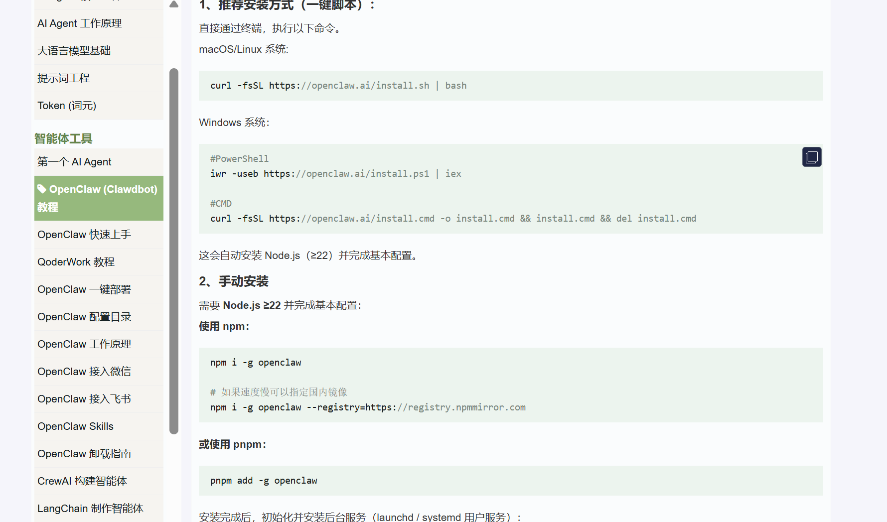

# 📖 精选教程汇总

这里人工筛选了 OpenClaw 最值得阅读的第三方教程，涵盖从零组装到进阶开发。让你不再需要花钱找人装虾。

>*点击链接即可跳转教程原网站*



## 🌟 入门首选！！

> 这一部分推荐的教程适合刚开始接触OpenClaw的小白。

### 飞书官方教程
[OpenClaw x 飞书官方修炼指南](https://larkcommunity.feishu.cn/wiki/GGJPwJ2IfiTynVk2Vy4cZbRvn2f?from=from_copylink)


这一份飞书出品的教程最大的特点就是**看着不累**！文档除了推荐使用飞书自己的一键部署产品之外，也还是认真地介绍了本地部署的方式。大家可以根据自己的需求和系统，通过目录快速找到自己想读的内容。

> 一句话：推荐想要快速了解入门，侧重应用、产品端的朋友们。

### Datawhale团队出品教程
[Hello Claw - GitHub库](https://github.com/datawhalechina/hello-claw)

[Hello Claw - 教程网站](https://datawhalechina.github.io/hello-claw)

**十分、强烈、推荐！！！想要学习本地部署的同学赶紧来看！！！**


Datawhale 是一个专注于人工智能领域的非营利性开源学习社区 / 组织。该项目（hello-claw）是 Datawhale 推出的首个体系化 OpenClaw 中文开源教程，旨在帮助用户从零开始掌握这个 *基于命令行（CLI）* 的强大 AI 智能体（Agent）系统。

```js
🚀 hello-claw 项目核心特点

1. 全栈式学习曲线：内容设计涵盖了从“领养”（面向普通用户的一键部署、多端接入）到“进化”（面向开发者的架构解析、自定义插件开发）的完整路径。
2. 多端生态集成：突破了传统的 CLI 限制，重点指导用户如何将 AI Agent 接入 飞书 (Lark)、Telegram 等社交与办公平台，实现 24/7 在线的即时交互。
3. 极简部署体验：针对新手优化了安装流程，提供基于 Docker 和一键脚本的方案，显著降低了配置环境变量和运行环境的门槛。
4. 工程化扩展能力：强调插件化架构，支持用户通过编写简单的代码逻辑来扩展 AI 的功能，如自动化工作流、定时任务处理等。
5. 社区驱动与本土化：由 Datawhale 出品，文档语言通俗易懂，且针对国内常见的 API 模型、网络环境进行了深度适配与优化。
```

> 一句话：推荐想要从零开始掌握本地部署的同学来看。

### 菜鸟教程

[菜鸟教程 - OpenClaw 教程](https://www.runoob.com/ai-agent/openclaw-clawdbot-tutorial.html)

该说不说，菜鸟教程还是真正的神！！！还是和以前一样细致，全面。



> 一句话：推荐有技术/编程基础的同学们，这个教程简单直白。

### Clawcn - OpenClaw 中文站

[clawcn](https://clawcn.net/)

这个网站汇总了最早支持OpenClaw的应用的接口方法（相对于26年3月25日来说较早，没有微信、企业微信）。

### OpenClaw 中文社区

[OpenClaw 中文社区](https://clawd.org.cn)

这个站点的原理是把openclaw的所有东西、流程都汉化了。
Github上面是这样介绍的：
```markdown
🇨🇳 完整中文化 — CLI、Web 控制界面、配置向导全部汉化
……
本项目非官方 cn 版本，此项目的目的是为了让国内用户快速接入使用，并更加适配国内网络环境。……
```

我自己没有试过，感觉可以一试！


## 🌟 了解安全与危险！！

```js
如果学习OpenClaw有三件必须学习的事情，那么第一件是安全，第二件也是安全，第三件还是安全。
```

1. [OpenClaw安全使用实践指南](https://mp.weixin.qq.com/s/L9AKvAFMB6kE2EcRSvTxZw)

（国家互联网应急中心CNCERT、中国网络空间安全协会 联合发布）

2. [《OpenClaw安全部署与实践指南（360护航版）》](https://pub1-bjyt.s3.360.cn/bcms/%E3%80%8AOpenClaw%E5%AE%89%E5%85%A8%E9%83%A8%E7%BD%B2%E4%B8%8E%E5%AE%9E%E8%B7%B5%E6%8C%87%E5%8D%97%EF%BC%88360%E6%8A%A4%E8%88%AA%E7%89%88%EF%BC%89%E3%80%8B.pdf)

3. [Clawd 中文社区 安全指南](https://clawd.org.cn/forum/post?id=3025)

## 🌟 Skills学习！！

```js
⚠⚠⚠还是那句话，注意防范风险！！！
```

### Awesome OpenClaw Skills

[awesome-openclaw-skills](https://github.com/VoltAgent/awesome-openclaw-skills)

虽然是英文的内容，但是还是几乎最全面的skills汇总。

### SkillHub 

[SkillHub](https://skillhub.tencent.com/)

网站自己介绍是“专为中国用户优化的 AI Skills 社区”。网站首页就有 *精选 TOP 50 AI Skills 榜单，从 ClawHub 生态中精选最值得安装的 50 个 AI Skills，国内高速镜像，一键加速安装。* 

### GitHub 话题

[GitHub OpenClaw Skill 话题](https://github.com/topics/openclaw-skill)

有事没事可以逛一逛~~~

### 水产市场

[水产市场](https://openclawmp.cc)

很好玩、很漂亮的一个Agent相互学习社区，你还可以 *把下面的指令发给 Agent，将 Ta 加入水产市场*

```bash
帮我安装技能，命令行指令是 curl -sL https://openclawmp.cc/api/v1/assets/s-65623b82a16d719e/download -o /tmp/_oc_pkg.zip && unzip -oq /tmp/_oc_pkg.zip -d ~/.openclaw/skills/openclawmp && rm /tmp/_oc_pkg.zip
```


*持续更新中…………*